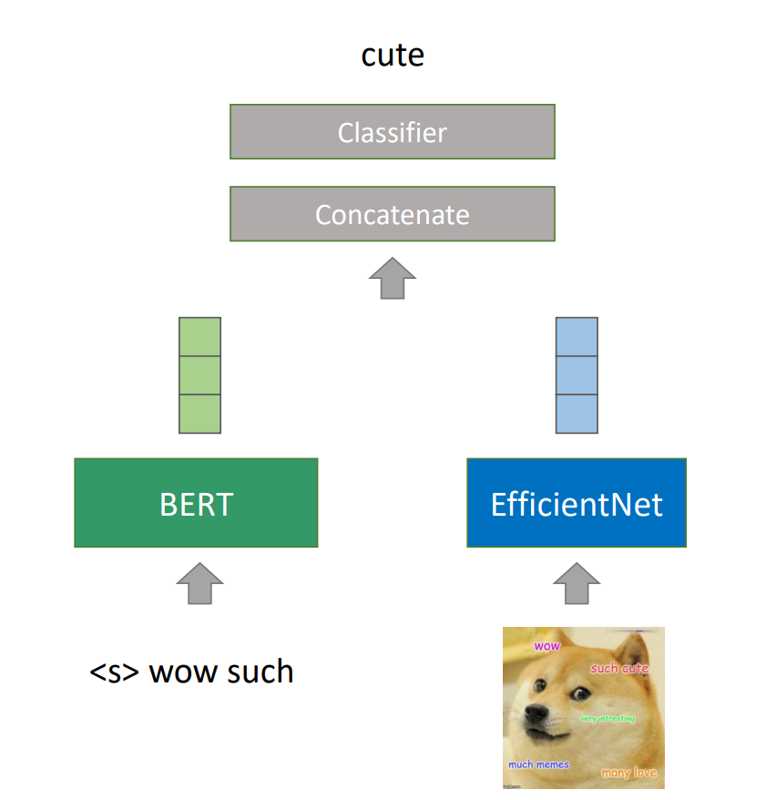

# Meme Captioning 
#### Dataset : https://www.kaggle.com/abhishtagatya/imgflipscraped-memes-caption-dataset
#### Result:
Model|Bleu Validation Set| Bleu Test Set
------------ | ------------- | -------------
Baseline|0.166885305007894|0.176795573542837
Our|0.199753410297558|0.19613209578611

***This project is try to do some kind of ocr by image captioning model and the result isn't admireable

## To run the code:
1. Download dataset from https://www.kaggle.com/abhishtagatya/imgflipscraped-memes-caption-dataset
2. Run 01_download.py
3. Run 02_preprocess.ipynb in the first part
4. Run 03_resize.py 
5. Run 02_preprocess.ipynb in the second part
6. Run model.ipynb

#### Ref: 
- https://www.tensorflow.org/tutorials/text/image_captioning
- https://github.com/shravannambiar11/Image-captioning-using-Keras
- https://github.com/Div99/Image-Captioning
- https://github.com/Moeinh77/Image-Captioning-with-Beam-Search
